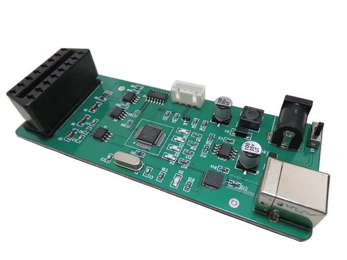

# obd-simulator

It is Make-based development environment for Neulen HD-OBD open source board.

## About

  

The board is available on Aliexpress: https://www.aliexpress.com/i/1005005688732830.html

## Build

To build the project adapt Makefile (TOOLCHAIN) and run 

    make 

Clean target:

    make clean

## TODO
* Fix _REDUCE_SIZE_WORKAROUND_
* Fix Wno-missing-braces
* Remove unused/redundant lib sources
* Add documentation
* Add openocd config
* Better readme
* Refactor the code